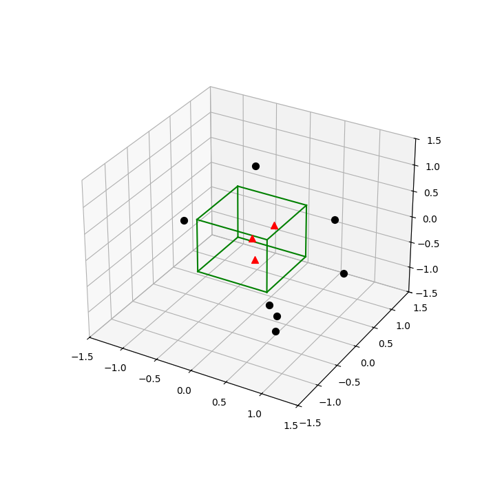
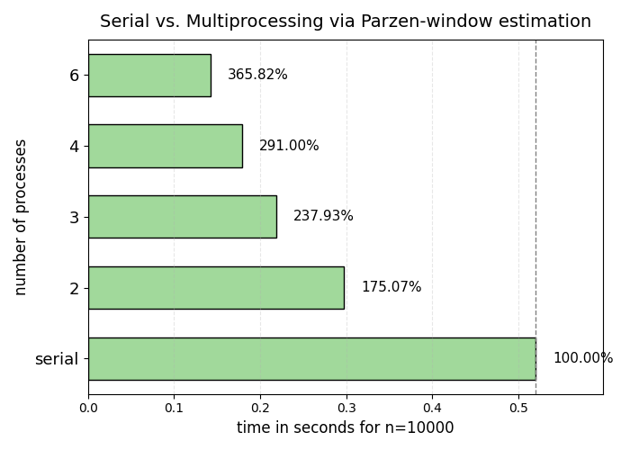

# Parallel-Kernel-Density-Estimation-Benchmark

## Introduction
This project implements the Parzen window estimation method using both serial and multiprocessing approaches in Python. The goal is to evaluate the performance differences between the two methods when estimating the probability density function (PDF) of a multidimensional Gaussian distribution.

## Problem Description
Parzen window estimation is a non-parametric technique used to estimate the PDF of a random variable. It works by averaging kernel functions centered at each data point. In this project, we implement a uniform (hypercube) kernel and apply it to a two-dimensional Gaussian distribution.

To help visualize the concept, the following figure shows a 3D example where the green cube represents the Parzen window centered at the origin. Red triangles indicate sample points that fall inside the window (and contribute to the density estimation), while black dots are samples that fall outside and are ignored:

> [!TIP]
> Think of the Parzen window like placing a cube over a fair stand in a park and counting how many customers (sample points) walk within that area. Only the people inside the cube are considered for estimating how popular that spot is.

## Approach
The project is organized into three main scripts:

- `serial_version.py`: Executes Parzen window estimation in a serial loop.
- `parallel_version.py`: Executes the same estimation using Python multiprocessing.
- `utils.py`: Contains shared functions, including the Parzen estimation logic, data generation, result saving, and plotting utilities.

Each version:
- Uses synthetic data generated from a 2D Gaussian distribution.
- Estimates the PDF at the origin for multiple window widths (`h`).
- Saves results in CSV format.
- Generates and saves plots in the `plots/` directory.

In the parallel version, benchmarking is performed across different numbers of processes: 1 (serial), 2, 3, 4, and 6.

## Benchmarking Results
The benchmarking results reflect the total execution time required to compute density estimations for a dataset of 10,000 points, using multiple window widths. The following table summarizes the performance:

| Processes | Time (seconds) | Speedup (%) |
|-----------|----------------|-------------|
| 1 (serial)| 0.5203         | 100.00%     |
| 2         | 0.2972         | 175.07%     |
| 3         | 0.2186         | 237.93%     |
| 4         | 0.1788         | 291.00%     |
| 6         | 0.1422         | 365.82%     |

The following chart clearly illustrates the performance gains with increasing number of processes:

## Conclusions
- Multiprocessing significantly reduces the runtime of Parzen window estimation, especially when using 4 or more processes.
- The benefit of adding more processes diminishes beyond a certain point due to multiprocessing overhead.
- This project demonstrates the importance of parallel computing for computationally expensive statistical estimators.

Overall, the results validate the effectiveness of using Python's multiprocessing capabilities for scalable data analysis tasks.

## Authors
* Caballero Coll Alejandro
* Chiquete Ayala Paulina
* Dominguez Jaber T. Estefania
* Monroy Minero Diego